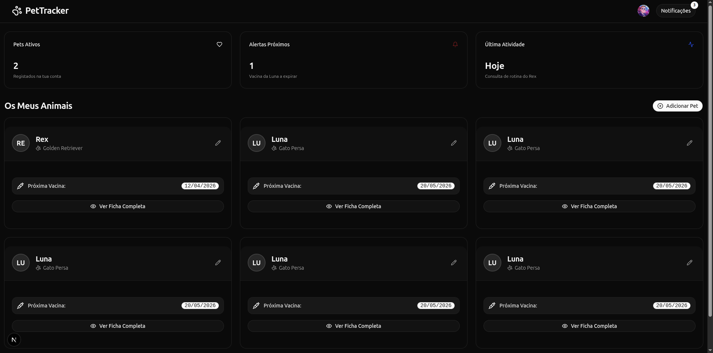
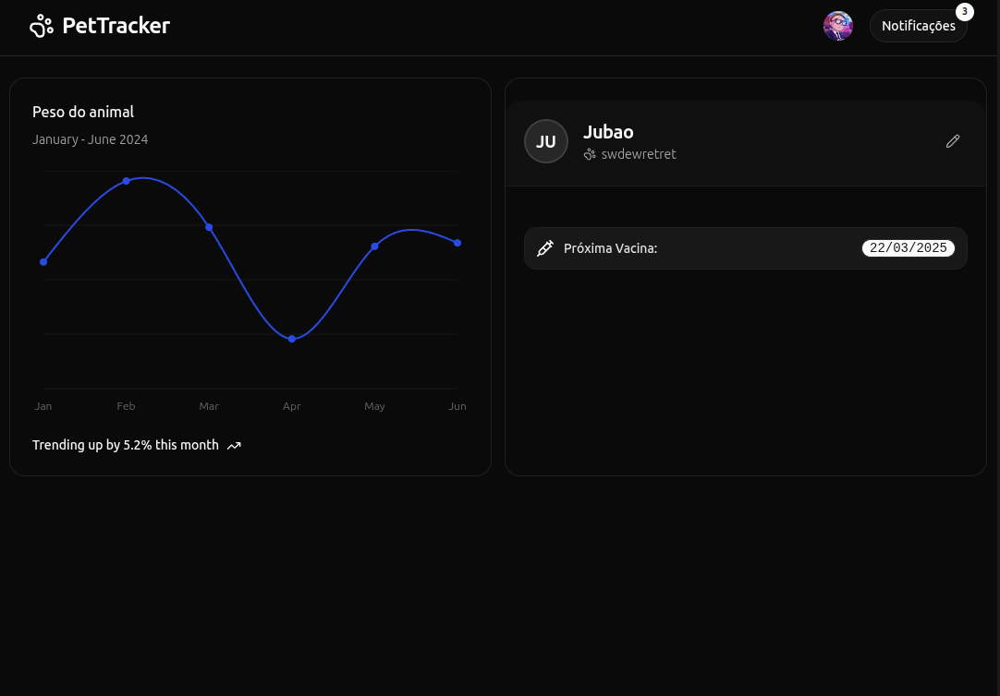
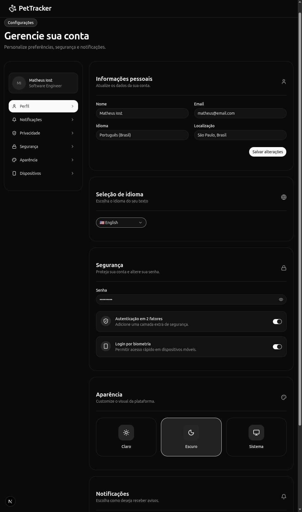

# 🐾 PetTracker Frontend

PetTracker is a modern pet management platform designed to help pet owners organize and manage their pets' information in one place.

This repository contains the frontend application built with Next.js, TypeScript, and modern web technologies.

## ✨ Features

### Authentication & Security

- User registration
- User login
- JWT authentication
- Refresh token support
- Protected routes

### Pet Management

- Create pets
- View pet details
- Update pet information
- Delete pets
- Manage pet profiles

### Dashboard

- Overview of registered pets
- Quick access to pet information
- User-friendly interface

### Media Uploads

- Upload pet profile images
- AWS S3 integration

### Internationalization

- English support
- Portuguese support
- Locale-based routing

### User Experience

- Responsive design
- Mobile-friendly interface
- Modern UI components
- Form validation
- Loading and error states

---

## 🛠️ Tech Stack

### Frontend

- Next.js 15
- React 19
- TypeScript

### Styling

- Tailwind CSS
- shadcn/ui
- Lucide React

### Data Fetching

- TanStack Query (React Query)
- Axios

### Forms & Validation

- React Hook Form
- Zod

### Internationalization

- next-intl

### Code Quality

- ESLint
- TypeScript

---

## 📂 Project Structure

```bash
src/
├── app/
├── components/
├── features/
├── hooks/
├── services/
├── lib/
├── providers/
├── i18n/
├── types/
└── middleware.ts
```

---

## 🚀 Getting Started

### Prerequisites

- Node.js 20+
- npm, pnpm, yarn, or bun

### Installation

Clone the repository:

```bash
git clone https://github.com/your-username/pettracker-frontend.git
```

Navigate to the project directory:

```bash
cd pettracker-frontend
```

Install dependencies:

```bash
npm install
```

Create a local environment file:

```bash
cp .env.example .env.local
```

Configure the required environment variables:

```env
NEXT_PUBLIC_API_URL=http://localhost:3001/api
```

Start the development server:

```bash
npm run dev
```

Open your browser and visit:

```text
http://localhost:3000
```

---

## 📜 Available Scripts

Run the development server:

```bash
npm run dev
```

Build the project:

```bash
npm run build
```

Start the production server:

```bash
npm run start
```

Run linting:

```bash
npm run lint
```

---

## 🔗 Backend API

This application consumes the PetTracker Backend API built with NestJS.

Backend features include:

- JWT Authentication
- Refresh Tokens
- Role-Based Access Control (RBAC)
- AWS S3 File Uploads
- Database Integration
- RESTful API Architecture

---

## 📸 Screenshots

```md





```

---

## 🎯 Roadmap

- Pet vaccination tracking
- Medical records management
- Appointment scheduling
- Reminder notifications
- Dark mode support
- Advanced dashboard analytics

---

## 👨‍💻 Author

**Matheus Iost**

Full Stack Developer

### Technologies

- React
- Next.js
- NestJS
- TypeScript
- AWS

---

## 📄 License

This project is licensed under the MIT License.

---

## ⭐ About the Project

PetTracker was created as a full-stack portfolio project to demonstrate modern web development practices, including authentication, API integration, cloud storage, internationalization, and responsive user interface design.
